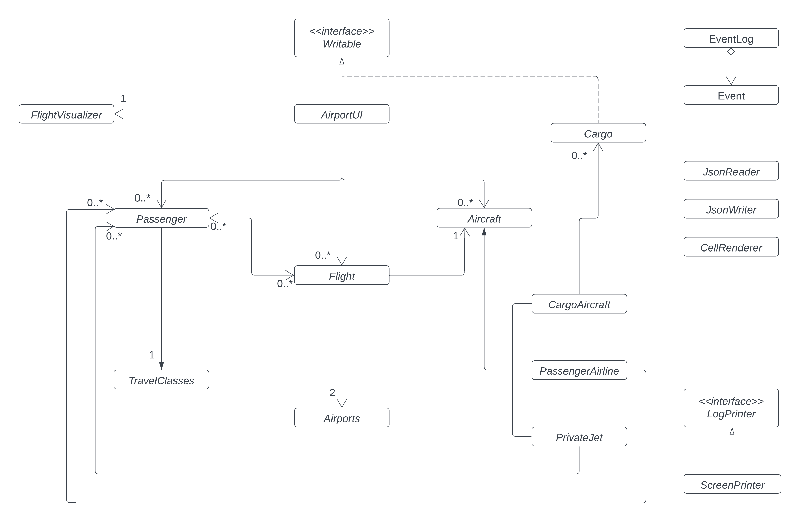
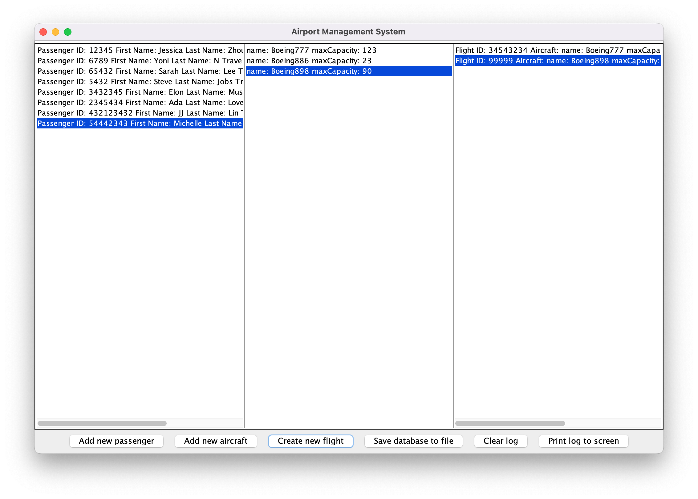
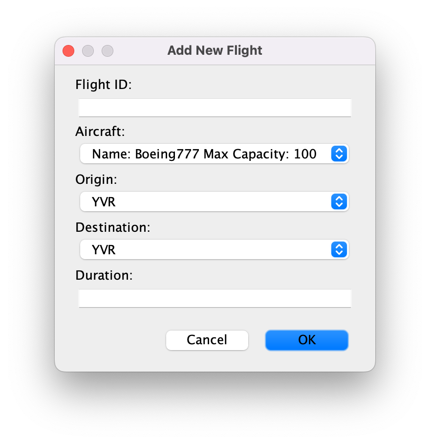

# Airport Information Management Application
**Created by Jessica Zhou** 

### Overview

This is an airport information management system. This program 
mimics the internal operations that happen at an international 
airport. It lets the user enter information about new passenger, 
planes, and create new flights. Possible features include different 
planes; adding passengers to the flight; listing all the passengers 
on the aircraft; and searching up flights to a given destination. 

## Phase 0-2: User Stories

### What will the application do?
<p>This application stores information that the user inputs about 
passengers, planes, and flights in a system such that it easy for 
the user to then pull information from the program to create new 
flights. Additionally, it can also search for existing flights 
given a destination.</p>

### Who will use it? 
<p>Airline managers who want to coordinate efficient operations at 
the airport through creating flights, booking passengers onto and 
off flights, and being able check for flights.</p>

### Why is this project of interest to you?
<p>The airport is such a vibrant and chaotic place. I am fascinate 
by how airport systems are able to coordinate the sheer amount of 
people, flights, and passengers coming from around the world. As a 
business and computer science student, I wanted to create a project 
that can manage the mass amount of information at a 
surface level.</p>

**Task 3:**

- [x] As a user, I want to be able to add a new passenger to an aircraft
- [x] As a user, I want to be able to remove a passenger on the aircraft
- [x] As a user, I want to be able to add a passenger
- [x] As a user, I want to be able to add a new aircraft
- [x] As a user, I want to be able to add a new flight
- [x] As a user, I want to be able to view all the passengers
- [x] As a user, I want to be able to save the all the data that I have inputted (if I so choose)
- [x] As a user, I want to be able to reload airport inputs from the file
- [x] As a user, I want to be able to log the user actions (with time stamps)
- [ ] As a user, I want to be able to view all the flights on a map

## Phase 3: Instructions for Grader

### Adding
- You can generate the first required action related to adding Xs to a Y by
  clicking on the "Create new flight" button, filling in the required information,
  selecting one of the aircraft in the system using the dropdown select option,
  and clicking "OK"
### Removing
- You can generate the second required action related to adding Xs to a Y by 
  clicking on a flight from the list of flights on the screen, selecting 
  "Add Passenger" button, selecting a passenger from the dropdown, and clicking "OK".
### Visual Component
- You can locate my visual component by clicking on anyone of the cells. Pictures of an 
  aircraft or passenger profile will pop up.
### Saving and Reloading
- You can save the state of my application by clicking on the "Save database to file" 
  button or by clicking "Yes" when prompted upon exiting the application.
- You can reload the state of my application by clicking on "Yes" when prompted upon
  running the program

**Important Notes:**
1. Pop up windows may glitch but is not an error in the code. To fix, add new data entries. 
   (Methods in the Java library seem to work better when it can switch to another cell). 
2. Users must have data entries for aircraft before creating a new flight. Likewise, there must be 
   data entries for passengers before being able to add passengers to a flight and the passenger must
   be already added to the flight to be removed. 
3. The "view flights" button is not fully functioning. It is a wishlist feature.
4. Clicking on the cells will show a popup window with a button to edit/change the information. 
   This is not fully functioning. It is a wishlist feature. 
5. Counters at the top are not functioning. It is a wishlist feature.
6. If the error: A JSONObject text must begin with '{' at 0 [character 1 line 1] occurs. Go in data > airport.json
   and insert the following code. (There is a tendency for the application to delete all file)
```
{
  "listOfPassengers": [],
  "listOfAircraft": [],
  "listOfFlights": []
}
```

## Phase 4: Event Logging and Design Reflection

### Task 2: Event Log Sample
```
Mon Apr 03 20:01:32 PDT 2023
Added private jet aircraft: Boeing898
Mon Apr 03 20:02:16 PDT 2023
Added flight in Sarah's bookings list
Mon Apr 03 20:02:16 PDT 2023
Added passenger (on flight): Sarah
Mon Apr 03 20:02:26 PDT 2023
Added flight in Elon's bookings list
Mon Apr 03 20:02:26 PDT 2023
Added passenger (on flight): Elon
Mon Apr 03 20:02:32 PDT 2023
Added flight in JJ's bookings list
Mon Apr 03 20:02:32 PDT 2023
Added passenger (on flight): JJ
Mon Apr 03 20:02:43 PDT 2023
Removed passenger: Elon
Mon Apr 03 20:02:48 PDT 2023
Removed passenger: JJ
```

### Phase 4: Task 3: Design Reflection

### UML Diagram



### Refactoring

The coupling is the most not the ideal as there tends to be may collections. Namely, lists of passengers 
are used quite frequently. The cohesion is high however I believe that I could have made better uses of 
abstract classes. I believe that the GUI can be separated into multiple classes as there is quite a bit 
of code that can be grouped together. There is room for improvement and with more time, the relationship 
between the classes can be improved. Namely, the bi-directional relationships in the code can be refactoring
such that saving and reloading using JSON will be less difficult. By doing so, the coupling in this application 
would decrease.

### GUI sampler




### What's Next?
- [ ] Implementing an API that will allow users to map flights according to location
- [ ] Adding features that would enable visual components of the (ie. the aircrafts) 
      to be able to move on the screen